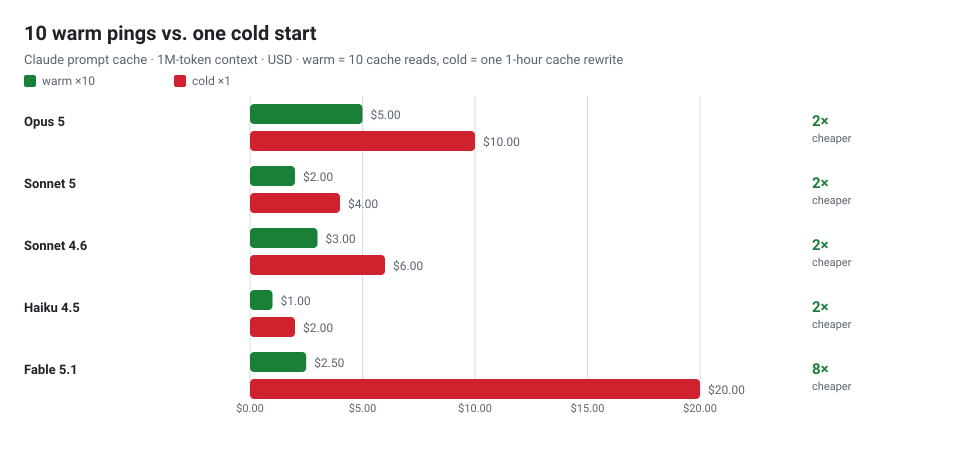

# claude-code-cache-keepalive

[English](README.md) · **简体中文**

<p>
<a href="LICENSE"></a>
<a href="test.sh"></a>


<a href="https://linux.do"></a>
</p>

**给 Claude Code 的 prompt cache 保温，又不至于卡住你的终端。**

做法很简单：`Stop` hook 只在会话活跃时记一笔时间戳；后台由 **Monitor** 盯着它，
空闲够久（默认 **50 分钟**）才吐出一行。这一行会被 Claude Code 当成通知交给 Claude，
触发一次新回合——而这次请求会命中缓存，把 prompt cache 的 TTL 重新续上。
一次很便宜的缓存读，省掉一次昂贵的整段重写。

这是按 **1 小时** 缓存 TTL 设计的；如果你那边是 5 分钟 TTL，把 `CCKA_IDLE_SECONDS`
改成 `240` 就行。

## 能省多少

<picture>
  <source media="(prefers-color-scheme: dark)" srcset="docs/cost-chart-dark.svg">
  
</picture>

10 次 ping（缓存**读**）对比 1 次冷启动（1 小时缓存**重写**），单位 USD：

| 模型 | 100K 上下文 | 1M 上下文 | 省下 |
| --- | ---: | ---: | ---: |
| Opus 5 / 4.8 / 4.7 / 4.6 | $0.50 → $1.00 | $5.00 → $10.00 | **2×** |
| Sonnet 5 | $0.20 → $0.40 | $2.00 → $4.00 | **2×** |
| Sonnet 4.6 / 4.5 | $0.30 → $0.60 | $3.00 → $6.00 | **2×** |
| Haiku 4.5 | $0.10 → $0.20 | $1.00 → $2.00 | **2×** |
| Fable 5.1 | $0.25 → $2.00 | $2.50 → $20.00 | **8×** |

读法：`warm ×10 → cold ×1`。10 次 ping 大约能保温 **8 小时**；空闲满 12 小时就停止
ping，刚好卡在"20 次 ping = 一次 1 小时重写"的盈亏线以内。20K–1M 的完整表格、全部模型
和盈亏线见 **[docs/COST.zh-CN.md](docs/COST.zh-CN.md)**。

## 适合谁

✅ **官方 Claude Code 用户**——**Pro/Max 订阅**和 **Console API key** 都适用。
订阅套餐在额度内时，主对话的 prompt cache TTL 是 **1 小时**；只要你离开超过 1 小时，
下一条消息就得把整段前缀重新算一遍，既更慢，也比一次缓存读更吃额度。这个插件让前缀
一直保持温热，你回来时只走一次便宜的缓存读。默认参数（50 分钟）正是照 1 小时 TTL 定的。

API key 的默认 TTL 只有 **5 分钟**，那就得把参数调小，或者自己设成 1 小时——见"时序约束"。

❌ **不适合**：DeepSeek / GLM / OpenRouter 这类第三方 Anthropic 兼容网关，以及
Bedrock / Vertex / Foundry。**Monitor 工具只有官方才有**，这些环境下 monitor 根本起不来；
何况它们的缓存机制本来也不同。

## 原理

```
回合结束 (Stop) ─────────────► stamp hook: last_stop = now   （瞬间返回，不阻塞）
你提交 (UserPromptSubmit) ───► stamp hook: last_stop = now

后台 Monitor（随会话结束而终止）：
  每 TICK（默认 300s）：
    idle = now - last_stop
    idle < IDLE_SECONDS ? 什么都不做
                        : echo "<ping>"  ─► 作为通知投递给 Claude
                                              └► 新回合 → 读缓存 → 刷新 TTL
                                                 └► 回合结束 → Stop → 重新计时 → ↻
```

计时基准就是 `now - last_stop`，所以它是个**可重置的空闲计时器**：每来一次 Stop 就
重新计 50 分钟。你一直在对话时它绝不会来打扰，只有真的闲置了才会 ping。

### 为什么不沿用"让 Stop hook 睡觉"的做法

| | 让 Stop hook 睡觉 | **用 Monitor（本仓库）** |
|---|---|---|
| 等待期间卡住终端 | 会（得按 Esc） | **不会** |
| 受 8 次连续 block 限制 | 受 | **不受** |
| 一次能等约 50 分钟 | 不行（会触发 hook 超时） | **可以** |
| 空闲时的开销 | — | 本地 `sleep` 空转，0 token |
| 什么时候 ping | 每个回合之后 | 只在真的空闲时 |

## 安装

**方式一（推荐）：装成插件，Monitor 自动启动**

```
/plugin marketplace add demouo/claude-code-cache-keepalive
/plugin install cache-keepalive@claude-cache-tools
```

非交互式：

```bash
git clone https://github.com/demouo/claude-code-cache-keepalive.git
claude plugin marketplace add ./claude-code-cache-keepalive
claude plugin install cache-keepalive@claude-cache-tools
```

插件自带 `monitors/monitors.json`（`"when": "always"`），会话一开 Monitor 就会自己起来。

**方式二：直接改 `settings.json`**

```bash
git clone https://github.com/demouo/claude-code-cache-keepalive.git
cd claude-code-cache-keepalive
./test.sh          # 可选自检
./install.sh       # 写入 hooks
```

这条路**不会自动启动 Monitor**，每个会话都得手动起一次：

```
Monitor(command="bash ~/.claude/hooks/cache-keepalive-monitor.sh", persistent=true)
```

## 配置

Monitor 的读取顺序是：**环境变量 → `~/.claude/cache-keepalive/config` → 默认值**。

| 变量 | 默认值 | 作用 |
|---|---|---|
| `CCKA_IDLE_SECONDS` | `3000` | 空闲多久才 ping（50 分钟） |
| `CCKA_TICK_SECONDS` | `300` | 检查间隔（5 分钟） |
| `CCKA_MAX_IDLE_SECONDS` | `43200` | 空闲超过这么久就停止 ping（12 小时；`0` = 不限） |
| `CCKA_PING_TEXT` | 一句无害的话 | 注入给 Claude 的内容 |
| `CCKA_ENABLED` | `1` | 设成 `0`/`false`/`no`/`off` 可关闭 |
| `CCKA_RETENTION_DAYS` | `7` | 多久之前的会话状态会被归档 |
| `CCKA_ARCHIVE_KEEP_DAYS` | `0` | 归档保留多久（`0` = 永久） |
| `CCKA_HOUSEKEEP_INTERVAL` | `21600` | 两次清理之间的最小间隔（秒） |

时序约束：`IDLE + (TICK - 1)` 必须小于缓存 TTL（默认组合最坏 55 分钟，仍在 1 小时以内）。

## 验证

```bash
./test.sh        # 29 项自检，不需要装 Claude Code
```

运行时日志按会话分开：

```bash
tail -f ~/.claude/cache-keepalive/cache-keepalive.<session-id>.log
# 看到 "emitting keepalive"，同时 Claude 自己冒出一句回复，就说明整条链路通了
```

## 开关与状态

Monitor 会随会话自动启动，但你可以让它不启动、也可以随时关掉，而且"关掉"会被记住：

| 想要 | 怎么做 |
| --- | --- |
| 立刻停掉 | 在 Claude Code 的任务列表里按 `x` 删除，或 `/cache-keepalive:off` |
| **只关掉当前会话**（默认） | `/cache-keepalive:off`（写 per-session 标记，其他会话和以后的新会话都不受影响） |
| **全部关掉**，并且保持关闭 | `/cache-keepalive:off-all`（会写一个全局标记） |
| 这个项目不要启动 | `touch <项目>/.claude/cache-keepalive-off` |
| 哪儿都不要启动 | 在 `~/.claude/cache-keepalive/config` 里写 `CCKA_ENABLED=0` |
| **只重新打开当前会话** | `/cache-keepalive:on`，然后 `/reload-plugins` |
| **全部重新打开** | `/cache-keepalive:on-all`，然后 `/reload-plugins` |
| 看现在在不在跑 | `/cache-keepalive:status` |

`/cache-keepalive:off` 是**会话级**的：它只停掉**你当前所在会话**的那个 monitor，
并写入 `~/.claude/cache-keepalive/disabled.<会话 id>`。于是这个会话 id 之后不会
再自动启动 monitor，而其他开着的会话、以及以后新开的会话都照常工作——适合
“只想让当前这段对话别再 ping”的情况。`/cache-keepalive:on` 可以解除。

`/cache-keepalive:off-all` 是**全局**开关：停掉所有 monitor，并写入
`~/.claude/cache-keepalive/disabled`。monitor 在**每次启动**时都会先看这个标记，
所以之后再 `/reload-plugins`、或者开新会话，都**不会偷偷把它带回来**。
`/cache-keepalive:on-all` 会同时清掉全局标记和所有 per-session 标记。

手动按 `x` 删掉也没问题——状态是一致的：残留的 pid 文件会被清理，而且复用的 PID
绝不会被误杀。

同样的开关也提供成了普通脚本：

```bash
bash plugins/cache-keepalive/scripts/cache-keepalive-ctl.sh status|on|off|on-all|off-all
```

## 卸载

```bash
claude plugin uninstall cache-keepalive
# 或者（settings 方式）
./uninstall.sh --purge
```

## 注意事项

1. **依赖 Monitor 工具**：需要较新的 Claude Code；一旦设置了 `DISABLE_TELEMETRY`
   或 `CLAUDE_CODE_DISABLE_NONESSENTIAL_TRAFFIC`，Monitor 就不可用；Bedrock /
   Vertex / Foundry 也不支持。插件 monitor 只在**交互式 CLI** 会话里运行。
2. **订阅和 API 都适用**。订阅制下的价值不在省 token 账单，而在于避免"空闲超过
   1 小时后再把整段前缀重新算一遍"——那更慢，也更吃套餐额度；ping 本身只花一次缓存读。
3. **每次 ping 都是一个真实回合**：会出现在对话记录里，消耗一次缓存读加一句回复。
4. **退出时会弹确认框**："Background work is running … Exit anyway?"（上游 issue
   #58852，官方标记为 not planned，插件侧关不掉）。默认选项就是 *Exit anyway*，
   回车即可。
5. 每个会话各自计时；隔很久再 resume 时会把过期的心跳重置成"现在"，不会一进来就 ping。
6. 旧的状态文件会在会话启动时按日期打包进 `archive/cache-keepalive-<日期>.tar.gz`。
7. 空闲超过 `CCKA_MAX_IDLE_SECONDS`（默认 12 小时）会停止 ping，免得晾着的会话白烧
   额度；一旦有新活动（发消息 / Stop）就自动恢复。

## 相关项目

- [yujiachen-y/claude-code-cache-keepalive](https://github.com/yujiachen-y/claude-code-cache-keepalive)
  —— 目标相同，走的是"让 Stop hook 睡觉"的路子：任何 provider 都能跑，但等待时会卡住
  终端、受 8 次 block 限制，一次最多只覆盖约 30 分钟。
- Aider 的 `--cache-keepalive-pings`、Cache-Refresh-SillyTavern、cline/cline#414
  —— 同一个"读缓存就会续 TTL"的思路，出现在别的工具里。

## 友链

* [LINUX DO](https://linux.do) —— 一个开放、友善的中文技术社区。

## License

MIT —— 见 [LICENSE](LICENSE)。
